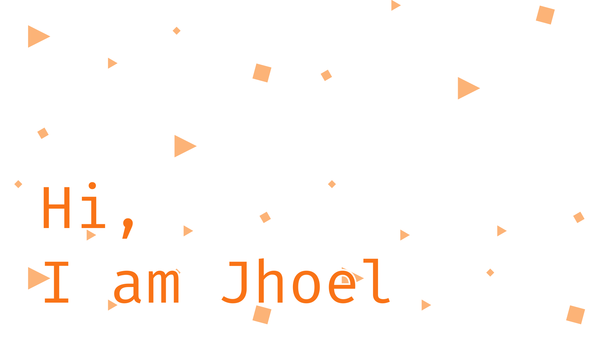

📓 I love to **learn and teach** things. I also enjoy keeping things organized.
Take a look at my
<a href="https://bagnascojhoel.notion.site/d1abc2bb1c904df2b8ff521fc36058da?v=d9c30756d44a4f25aa134421e2b7f37b" target="_blank">career
notes</a> on Notion.

🧠 I am a strong believer that anyone can learn anything, if enough time is
applied. So I apply that to everything that I wish to learn.

💻 I am currently working on **building a strong portfolio**. Check it out on
<a href="https://bagnascojhoel.com.br" target="_blank">bagnascojhoel.com.br</a>.

📝 You can guess from my Notion, but I also **like to write**. You can checkout
my <a href="https://blog.bagnascojhoel.com.br" target="_blank">recently created
blog</a>.

👨🏼‍🍳 I love to _cook_ new recipies. (Usualy they become good the third time I
try.)

### I have experience with the following technologies

#### Back-end

#### Front-end and Mobile

#### Observability

#### Cloud Services

#### Miscellaneous

